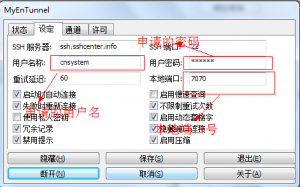

一直以来对墙外的世界都没有什么兴趣，觉得墙外没有什么吸引力

最近在捣鼓免费空间，给自己一个地方写博客，发现很多地方要国外的IP

于是，想翻墙吧（虽然不是必需的），看别人都翻得那么火热，自己也翻一把。

先是朋友介绍的自由门，但是服务器用不了，登不上去。

简单的就是找网页代理，但是速度很慢，不稳定，特别是脚本多的网站。

今天下午终于找到一个方法，就是用SSH

先是申请一个SSH账号，点击这里<a title="SSH免费注册" href="http://www.sshcenter.info/?ref=141826" target="_blank">申请</a>（只是两天）

然后下载一个软件<a href="http://www.sshcenter.info/software/myentunnel-unicode-3.5.2.zip">MyEnTunnel</a>。

&nbsp;

使用MyEnTunnel , 并进行配置

  
  
  

    cnsystem'blog
  

然后将本机sock5代理设为localhost:7070

这里端口号7070就是上面设置的，和SSH服务器通信的端口号

原理是：用SSH与国外服务器建立一条PPP隧道，将网页请求从7070端口出去。

对于GOOGLE的一些网站可以修改HOST文件

HOST文件在C:\Windows\System32\drivers\etc目录下，然后管理员权限打开

添加IP/Domain

我的HOST如下

<pre>209.85.147.109 pop.gmail.com
209.85.147.109 smtp.gmail.com
203.208.46.161 docs.google.com
209.85.225.102 groups.google.com
74.125.127.139 spreadsheets.google.com
74.125.127.100 services.google.com
74.125.127.100 writely.google.com
74.125.127.100 sites.google.com
209.85.225.104 reader.google.com
74.125.127.101 calendar.google.com
203.208.46.148 lh1.googleusercontent.com
203.208.46.148 lh2.googleusercontent.com
203.208.46.148 lh3.googleusercontent.com
203.208.46.148 lh4.googleusercontent.com
203.208.46.148 lh5.googleusercontent.com
203.208.46.148 lh6.googleusercontent.com
203.208.46.148 lh7.googleusercontent.com
203.208.46.148 s1.googleusercontent.com
203.208.46.148 s2.googleusercontent.com
203.208.46.148 images1-focus-opensocial.googleusercontent.com
203.208.46.148 images2-focus-opensocial.googleusercontent.com
203.208.46.148 images3-focus-opensocial.googleusercontent.com
203.208.46.132 webcache.googleusercontent.com
203.208.46.148 picasaweb.google.com
203.208.46.148 plus.google.com (GOOGLE+,谷歌的SNS）
203.208.46.148 talkgadget.google.com</pre>

有些理解可能错，就写到这里了，回头再好好看看