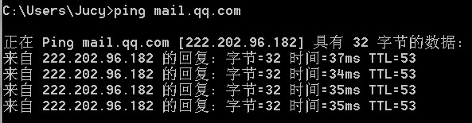

先看一张图片：

  
  
  

    ping mail.qq.com
  

我们常用Ping命令来看某计算机是否可达，特别是当我无法上网的时候。

举例：某办公室电脑不能上网了

1、首先PING局域网内的电脑，如果PING不同，说明局域网组网有问题，检查一下网线是否插好了，是否存在网络环路。

2、如果局域网的电脑能PING通了，如果有网关，在PING一下网关，以防交换机死机（温度过高，或者拥塞），因为有些是整栋的局域网，办公室是子网，网关是连接外网出口。

3、如果用代理服务器上网的，在PING一下代理是否可达。

4、最后是PING你要访问的网站，看是否会显示IP地址，查看是否DNS解析错误，或者无法解析。

大部分用户都是选择自动获取的，有些时候无法获取DNS服务器地址，所以无法解析。这时我们可以设置DNS，每个省都有DNS服务器，可以百度一下，或者设置为8.8.8.8 。不过建议还是自动获取，曾经我们的网站就是因为所设置的DNS出问题了导致无法解析。

关于DNS，每台电脑本机都有DNS缓存记录（试想每次都查询DNS服务器，上网该多慢啊），我们用

ipconfig /displaydns

可以查看本机的DNS缓存；用

ipconfig /flushdns可以刷新DNS缓存

总之PING命令是用来检测目标机是否可达，帮我们找到问题的关键所在。

然后补充一点IP地址的常识：\*.\*.\*.\* ,符号\*代表一个小于255的整数，加上子网掩码就可以从逻辑上划分子网。通常子网掩码是255.255.255.0，也就是说前三个\*的一样，逻辑上就在局域网里了。当然，还得物理上在一个局域网里，通常连接到同一个路由器和交换机的电脑，物理上都在一个局域网里。通常我们玩游戏的时候，局域网里没有玩家，有可能是IP不在一个网段，还有可能是防火墙问题。
