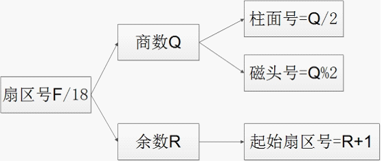

磁盘按层次分为磁面、磁道、扇区。扇区是磁盘的最小存储单位，一个扇区有512B大小，BIOS有的13H中断02号功能提供读取磁盘功能，03号功能提供写磁盘功能。

表4.1 13H中断02号功能
|中断号 |功能号(AH) |入口参数 |出口参数 |作用 |
|----- |----- |----- |----- |----- |
| 13H | 02H | AL=扇区数,DH=磁头号,CH=柱面号,CL=扇区号,DL=驱动器号,ES:BX=缓冲区地址|CF=0操作成功，AH=00H，AL=传输的扇区数；CF=1操作失败，AH=状态代码 | 读取指定的扇区到缓冲区 |
| 13H | 03H |AL=扇区数,DH=磁头号,CH=柱面号,CL=扇区号,DL=驱动器号,ES:BX=缓冲区地址|CF=0操作成功，AH=00H，AL=传输的扇区数；CF=1操作失败，AH=状态代码|把缓冲区数据写入到指定扇区|

对于，对于1.44MB的软盘来说，一共有两个磁面，每个磁面有80个磁道，每个磁道有18个扇区。即2*80*18*512=1.44MB。其磁头、柱面、扇区号的计算方法，如图4-1所示。

         

对于线性的扇区号F，分解为柱面号-磁头号-扇区号。之前所以柱面号在高位，是因为，磁盘在柱面是交叉存储的，也就是一个磁头的一个磁道写满之后，又写下一个磁头的磁道。读取扇区函数read_sector代码：
              
```asm
;************************************************
;功    能：	read扇区
;入口参数：	保存在堆栈中，依次为
;		 	1.扇区号
;		 	2.扇区数
;		 	3.缓冲区地址
;出口参数：	无	
;************************************************
read_sector:
	push	bp
	mov 	bp,sp
	pusha
	mov 	[num_retries],byte 0	
.loop:		
;扇区号(AX)	
	mov 	ax,	[bp+Seg_Outer_Offset]
;扇区(CL)：sector=L%18	
	div		Sec_PerCylinder
	mov 	cl,al
;柱面(CH)：cylinder=L/18/2
	mov 	al,ah
	xor 	ah,ah
	div 	2
	mov 	ch,ah
;柱头(DH): head=L/18%2
	mov 	dh,al
;读取扇区数(AL)
	xor 	ax,ax
	mov 	ax,[bp+Seg_Outer_Offset+2]	
;功能号(AH):02H
	xor 	ah,ah
	mov 	ah,02h
;驱动器(DL):00h
	mov 	dl,0
;缓冲区(BX)
	mov 	bx,[bp+Seg_Outer_Offset+4]
	int 	13h

	jnc 	.done
	inc		byte [num_retries]
	cmp		byte [num_retries],3;最多只重复读取3次
	jne		.loop
.done:
	popa
	pop bp
	ret
```
