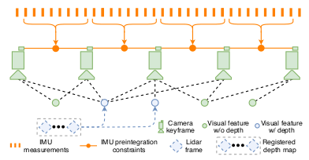
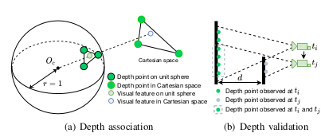

**摘要**——我们提出了一个通过平滑和映射实现紧密耦合的激光雷达-视觉-惯性测距技术的框架，称为LVI-SAM。LVI-SAM能够以高精度和强鲁棒性实时完成状态估计和地图构建。LVI-SAM建立在一个因子图上，并由两个子系统组成：一个是视觉-惯性系统（VIS），另一个是激光雷达-惯性系统（LIS）。这两个子系统以紧密耦合的方式设计，其中VIS利用LIS的估计结果以便进行初始化。

通过使用激光雷达测量数据来提取视觉特征的深度信息，可以提高VIS的准确性。反过来，LIS利用VIS的估计结果进行初始匹配。首先，VIS识别闭环，然后LIS进一步精细调整。LVI-SAM可以在其中一个子系统失效的情况下工作，这提高了它在无纹理和无特征环境中的鲁棒性。我们对LVI-SAM进行了广泛的评估，使用了多种平台和不同尺度和环境的数据集。我们的实现代码可在https://git.io/lvi-sam获取。

## I. INTRODUCTION

同时定位和地图构建（SLAM）是许多移动机器人导航任务所必需的基础功能。在过去的二十年中，使用SLAM在具有单一感知传感器（如激光雷达或相机）的具有挑战性的环境中进行实时状态估计和地图构建已取得了巨大成功。基于激光雷达的方法可以在远距离捕捉环境的细节。然而，在没有结构的环境中，例如长走廊或平坦的开放区域，这种方法通常会失败。虽然基于视觉的方法特别适合场所识别，并在纹理丰富的环境中表现良好，但它们对照明变化、快速运动和初始化非常敏感。因此，激光雷达和视觉方法通常分别与惯性测量单元（IMU）耦合，以增加它们各自的鲁棒性和精度。激光雷达-惯性系统可以帮助纠正点云畸变并解决短时间内特征缺失的问题。IMU测量可以恢复度量尺度和姿态以辅助视觉惯性系统。为了进一步提高系统性能，激光雷达、相机和IMU测量的融合越来越受到关注。

我们的工作与视觉惯性测距(VIO)，激光惯性测距(LIO)和激光-视觉惯性测距(LVIO)密切相关。我们注意到，本文不考虑非惯性系统，尽管我们知道已有成功的非惯性激光-视觉系统，如[1](#1-j-graeter-a-wilczynski-and-m-lauer-limo-lidar-monocularvisual-odometry-ieeersj-international-conference-on-intelligentrobots-and-systems-iros-pp-7872–7879-2018)，[2](#2-y-s-shin-y-s-park-and-a-kim-dvl-slam-sparse-depthenhanced-direct-visual-lidar-slam-autonomous-robots-vol-44no-2-pp-115–130-2020)。视觉惯性测距(VIO)主要分为两大类：基于滤波器的方法和基于优化的方法。基于滤波器的方法通常使用扩展卡尔曼滤波器(EKF)通过相机和IMU的测量来传播系统状态。基于优化的方法维护一个滑动窗口估计器，最小化视觉重投影误差以及IMU测量误差。在我们的工作中，我们仅考虑单目相机。在最受欢迎的公开VIO Pipeline中，MSCKF [3](#3-a-i-mourikis-and-s-i-roumeliotis-a-multi-state-constraint-kalmanfilter-for-vision-aided-inertial-navigation-ieee-international-conference-on-robotics-and-automation-icra-pp-3565–3572-2007，ROVIO) , RVIO[4](#4-m-bloesch-s-omari-m-hutter-and-r-siegwart-robust-visualinertial-odometry-using-a-direct-ekf-based-approach-ieeersjinternational-conference-on-intelligent-robots-and-systems-iros-pp)和OpenVINS [5](#5-p-geneva-k-eckenhoff-w-lee-y-yang-and-g-huang-openvinsa-research-platform-for-visual-inertial-estimation-iros-workshopon-visual-inertial-navigation-challenges-and-applications-2019)是基于滤波器的，而OKVIS [6](#6-s-leutenegger-s-lynen-m-bosse-r-siegwart-and-p-furgalekeyframe-based-visual-inertial-odometry-using-nonlinear-optimization-the-international-journal-of-robotics-research-vol-34-no-3pp-314–334-2015)和VINS-Mono [7](#7-t-qin-p-li-and-s-shen-vins-mono-a-robust-and-versatilemonocular-visual-inertial-state-estimator-ieee-transactions-onrobotics-vol-34-no-4-pp-1004–1020-2018)是基于优化的。尽管OKVIS使用立体相机表现出卓越的性能，但它没有针对单目相机进行优化。VINS-Mono在滑动窗口设置中执行非线性优化，并使用单目相机实现了最先进的准确性 [8](#8-j-delmerico-and-d-scaramuzza-a-benchmark-comparison-ofmonocular-visual-inertial-odometry-algorithms-for-flying-robotsieee-international-conference-on-robotics-and-automation-icrapp-2502–2509-2018)。

基于它们的设计方案，激光惯性里程计可以分为两大类：松耦合方法和紧耦合方法。其中LOAM [9](#9-j-zhang-and-s-singh-low-drift-and-real-time-lidar-odometry-andmapping-autonomous-robots-vol-41-no-2-pp-401–416-2017)和LeGO-LOAM [10](#10-t-shan-and-b-englot-lego-loam-lightweight-and-groundoptimized-lidar-odometry-and-mapping-on-variable-terrainieeersj-international-conference-on-intelligent-robots-and-systemsiros-pp-4758–4765-2018)是松耦合系统，因为IMU测量结果不会在优化步骤中使用。紧耦合系统通常提供更高的精度和鲁棒性，目前是持续研究的重点[11](#11-c-chen-h-zhu-m-li-and-s-you-a-review-of-visual-inertialsimultaneous-localization-and-mapping-from-filtering-based-andoptimization-based-perspectives-robotics-vol-7-no-3-p-45-2018)。在公开可用的紧耦合系统中，LIO-mapping [12](#12-h-ye-y-chen-and-m-liu-tightly-coupled-3d-lidar-inertialodometry-and-mapping-ieee-international-conference-on-roboticsand-automation-icra-pp-3144–3150-2019)采用[7](#7-t-qin-p-li-and-s-shen-vins-mono-a-robust-and-versatilemonocular-visual-inertial-state-estimator-ieee-transactions-onrobotics-vol-34-no-4-pp-1004–1020-2018)的优化流程并最小化IMU和激光雷达测量残差。由于LIO-mapping被设计为优化所有测量值，因此无法实现实时性能。LIO-SAM [13](#13-t-shan-b-englot-d-meyers-w-wang-c-ratti-and-d-rus-liosam-tightly-coupled-lidar-inertial-odometry-via-smoothing-andmapping-ieeersj-international-conference-on-intelligent-robotsand-systems-iros-pp-4758–4765-2020)通过引入激光雷达关键帧的滑动窗口，限制计算复杂度，并利用因子图进行联合IMU和激光雷达约束优化。专为地面车辆设计的LINS [14](#14-c-qin-h-ye-c-e-pranata-j-han-s-zhang-and-m-liu-linsa-lidar-inertial-state-estimator-for-robust-and-efficient-navigationieee-international-conference-on-robotics-and-automation-icrapp-8899–8906-2020)使用误差状态卡尔曼滤波器以递归方式修正机器人状态。

最近，由于其在传感器降级任务中的鲁棒性，激光雷达-视觉-惯性系统受到越来越多的关注[15](#15-c-debeunne-and-d-vivet-a-review-of-visual-lidar-fusion-basedsimultaneous-localization-and-mapping-sensors-vol-20-no-7-p)。[16](#16-j-zhang-and-s-singh-laser-visual-inertial-odometry-and-mappingwith-high-robustness-and-low-drift-journal-of-field-roboticsvol-35-no-8-pp-1242–1264-2018)提出了一种紧耦合LVIO系统，采用顺序处理流程，从粗到细解决状态估计问题。最粗略的估计从IMU预测开始，然后进一步通过VIO和LIO进行优化。[16](#16-j-zhang-and-s-singh-laser-visual-inertial-odometry-and-mappingwith-high-robustness-and-low-drift-journal-of-field-roboticsvol-35-no-8-pp-1242–1264-2018)目前在KITTI基准测试[17](#17-a-geiger-p-lenz-c-stiller-and-r-urtasun-vision-meets-roboticsthe-kitti-dataset-the-international-journal-of-robotics-researchvol-32-no-11-pp-1231–1237-2013)上实现了最先进的精度。基于MSCKF框架，[18](#18-x-zuo-p-geneva-w-lee-y-liu-and-g-huang-lic-fusionlidar-inertial-camera-odometry-arxiv-preprint-arxiv1909041022019)提供在线的空间和时间多传感器校准。[16](#16-j-zhang-and-s-singh-laser-visual-inertial-odometry-and-mappingwith-high-robustness-and-low-drift-journal-of-field-roboticsvol-35-no-8-pp-1242–1264-2018)和[18](#18-x-zuo-p-geneva-w-lee-y-liu-and-g-huang-lic-fusionlidar-inertial-camera-odometry-arxiv-preprint-arxiv1909041022019)的实现不是公开的。我们的工作与上述工作不同，我们利用因子图进行全局优化，可以通过*回路闭合检测*定期消除机器人的漂移。

本文提出了一个实时状态估计和建图的紧耦合激光雷达-视觉-惯性测量单元平滑与映射(LVI-SAM)框架。LVI-SAM基于一个因子图，由一个视觉惯性系统(VIS)和一个激光雷达惯性系统(LIS)两个子系统组成。两个子系统可以独立地运行，当一个系统出现故障时，或者当检测到足够的特征时，两个子系统可以联合工作。VIS执行视觉特征跟踪，并可选地使用激光雷达帧提取特征深度。通过优化视觉重投影误差和IMU测量误差来获得的视觉里程计，作为激光雷达扫描匹配的初始估计，并引入约束到因子图中。使用IMU测量进行点云去畸变后，LIS提取激光雷达边缘和平面特征，并将其匹配到滑动窗口中维护的特征地图。LIS中的估计系统状态可以发送到VIS中以促进其初始化。对于环路闭合，首先由VIS确定候选匹配，然后由LIS进一步优化。来自视觉里程计、激光雷达里程计、IMU预积分和环路闭合的约束在因子图中联合优化。最后，优化的IMU偏差项被利用以传播IMU测量以获得IMU速率下的姿态估计。我们工作的主要贡献如下：

* 基于因子图的紧密耦合LVIO框架，实现了多传感器融合和通过场所识别实现全局优化。

* 我们的框架通过故障检测来避免子系统的失败，使其对传感器退化具有鲁棒性。

* 我们的框架经过广泛验证，使用跨越不同尺度、平台和环境的数据进行了测试。

我们的工作在系统层面上是独特的，代表了VIO和LIO最先进技术的独特集成，实现了提高鲁棒性和准确性的LVIO系统。我们希望我们的系统可以作为一个坚实的基础，让其他人可以轻松地在此基础上推进激光雷达-视觉-惯性测距技术的最新进展。

## II. LIDAR VISUAL INERTIAL ODOMETRY VIA SMOOTHING AND MAPPING

### A.系统概述

图1：LVI-SAM的系统结构。该系统接收来自3D激光雷达、相机和IMU的输入，可以分为两个子系统：视觉惯性系统（VIS）和激光雷达惯性系统（LIS）。VIS和LIS可以独立运行，同时利用彼此的信息来提高系统的准确性和稳健性。该系统以IMU速率输出姿态估计。

本文提出的激光雷达-视觉-惯性系统，接收来自3D激光雷达、单目相机和IMU的输入，如图1所示。我们的框架由两个关键子系统组成：视觉-惯性系统（VIS）和激光-惯性系统（LIS）。VIS处理图像和IMU测量值，其中激光测量值是可选的。通过最小化视觉和IMU测量的联合残差获得视觉里程计。LIS提取激光特征，并通过将提取的特征与特征地图匹配来执行激光里程计。特征地图以滑动窗口方式维护，以实现实时性能。最后，通过使用iSAM2 [19](#19-m-kaess-h-johannsson-r-roberts-v-ila-j-j-leonard-andf-dellaert-isam2-incremental-smoothing-and-mapping-using-thebayes-tree-the-international-journal-of-robotics-research-vol-31no-2-pp-216–235-2012)在因子图中联合优化IMU预积分约束、视觉里程计约束、激光里程计约束和环路闭合约束的贡献，解决可以被表述为最大后验（MAP）问题的状态估计问题。需要注意的是，LIS中采用的多传感器图优化旨在减少数据交换并提高系统效率。

### B. Visual-Inertial System

图2: 我们的视觉惯性系统框架。该系统优化IMU预积分、没有深度信息的视觉测量和具有深度信息的视觉测量的残差。

我们为我们的VIS（视觉惯性系统）采用了[7](#7-t-qin-p-li-and-s-shen-vins-mono-a-robust-and-versatilemonocular-visual-inertial-state-estimator-ieee-transactions-onrobotics-vol-34-no-4-pp-1004–1020-2018)的Pipeline，如图2所示。使用角点检测器[20](#20-j-shi-et-al-good-features-to-track-ieee-conference-on-computervision-and-pattern-recognition-pp-593–600-1994)检测视觉特征并通过Kanade-Lucas-Tomasi算法[21](#21-b-d-lucas-t-kanade-et-al-an-iterative-image-registrationtechnique-with-an-application-to-stereo-vision-1981)进行跟踪。在VIS初始化后，我们使用视觉里程计对激光雷达帧进行配准，并获取用于特征深度估计的稀疏深度图像。系统在滑动窗口设置下执行束调整，其中系统状态 $x ∈ X$ 可以写成：

$$
x = \left[R, p, v, b \right]
$$

$R ∈ SO \left( 3 \right)$ 是旋转矩阵，$p ∈ R^3$ 是位移向量，$v$ 是速度，$b = \left[b_{a}，b_w \right]$ 是IMU偏差。$b_a$和$b_w$分别是加速度和角速度的偏差向量。从传感器体坐标系B到世界坐标系W的变换 $T ∈ SE \left(3\right)$ 表示为 $T = \left[R|p \right]$。在接下来的几节中，我们将详细介绍如何改善VIS初始化和特征深度估计的过程。由于篇幅限制，我们将读者引用到[7]以获取更多细节，如残差的实现。

1). **初始化**：基于优化的VIO通常由于在初始化时解决高度非线性问题而导致发散。初始化的质量严重依赖于两个因素：初始传感器运动和IMU参数的准确性。在实践中，我们发现[7]在传感器行驶速度较小或恒定时常常无法初始化。这是因为当加速度激励不够大时，度量尺度不可观测。IMU参数包括缓慢变化的偏置和白噪声，影响原始加速度和角速度测量。在初始化时这些参数的良好猜测有助于优化更快地收敛。

为了提高我们的VIS初始化的鲁棒性，我们利用了LIS估计的系统状态x和IMU偏置b。因为深度可以直接从激光雷达中观测到，我们首先初始化LIS并获得x和b。然后我们基于图像时间戳对它们进行插值和关联到每个图像关键帧。请注意，IMU偏置被假定在两个图像关键帧之间保持不变。最后，LIS估计的x和b被用作VIS初始化的初始猜测，这显著提高了初始化速度和鲁棒性。有关使用和不使用LIS进行VIS初始化的比较，请参见[补充视频](!https://youtu.be/8CTl07D6Ibc)。

2). **特征深度关联**：在VIS初始化之后，我们使用估计的视觉里程计将激光雷达帧注册到相机帧。由于现代的3D激光雷达通常产生稀疏的扫描，我们堆叠多个激光雷达帧以获取密集的深度图。为了将特征与深度值关联起来，我们首先将视觉特征和激光雷达深度点投影到以相机为中心的单位球上。然后，使用极坐标将深度点进行下采样并存储，以保持球面上的恒定密度。我们通过使用视觉特征的极坐标搜索二维K-D树来查找最近的三个球面上的深度点。最后，特征深度是由视觉特征和相机中心Oc所形成的直线长度，在笛卡尔空间中与由三个深度点形成的平面相交。该过程的可视化可以在图3（a）中找到，其中特征深度是虚线直线的长度。

图3: 视觉特征深度关联.

我们进一步通过检查最近的三个深度点之间的距离来验证关联的特征深度。这是因为来自不同时间戳的叠加激光雷达帧可能导致深度模糊，来自不同物体的深度点混杂在一起。图3（b）展示了这种情况的示例。绿色表示在时间ti观测到的深度点，灰色表示在tj时相机移动到新位置观察到的深度点。然而，由于激光雷达帧的叠加，ti时观察到的深度点（由虚线灰圆圈表示）可能仍然在tj时可见。使用来自不同物体的深度点关联特征深度会导致不准确的估计。与[16](#16-j-zhang-and-s-singh-laser-visual-inertial-odometry-and-mappingwith-high-robustness-and-low-drift-journal-of-field-roboticsvol-35-no-8-pp-1242–1264-2018)类似，我们通过检查特征的最大深度点距离来拒绝这样的估计。如果最大距离大于2m，则特征没有深度关联。

图4: Registed 深度图和视觉特征。在（a）和（c）中，深度图的颜色变化表示深度变化。在（b）和（d）中，绿色点是成功与深度相关联的视觉特征。未能通过深度关联过程的特征为红色。.

一个展示Registered深度图和视觉特征的演示如图4所示。在图4（a）和（c）中，使用视觉里程计注册的深度点被投影到相机图像上。在图4（b）和（d）中，成功关联深度的视觉特征被标为绿色。请注意，尽管深度图在图4（a）中覆盖了大部分图像，但由于验证检查失败，许多位于窗户角落的特征在4（b）中缺乏深度关联。

3). **故障检测**：由于激烈运动、光照变化和无纹理环境等原因，VIS容易出现故障。当机器人经历激烈运动或进入无纹理环境时，跟踪特征点的数量会大大减少。特征点不足可能导致优化发散。我们还注意到当VIS发生故障时，会估计出大的IMU偏差。因此，当跟踪的特征点数量低于阈值或估计的IMU偏差超过阈值时，我们报告VIS故障。我们的系统需要进行主动故障检测，以确保其故障不会破坏LIS的功能。一旦检测到故障，VIS将重新初始化并通知LIS。

4). **闭环检测**: 我们利用DBoW2[22](#22-d-g´alvez-l´opez-and-j-d-tardos-bags-of-binary-words-forfast-place-recognition-in-image-sequences-ieee-transactions-onrobotics-vol-28-no-5-pp-1188–1197-2012)进行闭环检测。对于每个新的图像关键帧，我们提取BRIEF描述符[23]并将其与之前提取的描述符进行匹配。由DBoW2返回的闭环候选图像的时间戳将发送到LIS进行进一步验证。

### C. Lidar-Inertial System

Fig. 5: 我们的激光雷达惯性系统框架。该系统维护一个包含四种约束类型的因子图。

如图5所示，所提出的激光惯性系统是从[13](#13-t-shan-b-englot-d-meyers-w-wang-c-ratti-and-d-rus-lio-sam-tightly-coupled-lidar-inertial-odometry-via-smoothing-andmapping-ieeersj-international-conference-on-intelligent-robotsand-systems-iros-pp-4758–4765-2020)改编而来，为全局姿态优化维护一个因子图。在该图中，添加了四种类型的约束：IMU预积分约束、视觉里程计约束、激光里程计约束和闭环约束，并进行联合优化。激光里程计约束是从扫描匹配中得出的，我们将当前激光关键帧与全局特征地图进行匹配。闭环约束的候选项首先由VIS提供，然后通过扫描匹配进一步优化。我们维护一个激光关键帧的滑动窗口，用于特征地图，以保证有界的计算复杂度。当机器人姿态变化超过阈值时，选择一个新的激光关键帧。在键帧之间的间歇性激光帧被丢弃。在选择新的激光关键帧时，将一个新的机器人状态x添加到因子图中作为节点。以这种方式添加关键帧不仅可以在记忆消耗和地图密度之间达到平衡，而且有助于维护相对稀疏的因子图以进行实时优化。由于空间限制，我们将读者引用到[13](#13-t-shan-b-englot-d-meyers-w-wang-c-ratti-and-d-rus-lio-sam-tightly-coupled-lidar-inertial-odometry-via-smoothing-andmapping-ieeersj-international-conference-on-intelligent-robotsand-systems-iros-pp-4758–4765-2020)中查看具体实现细节。在接下来的章节中，我们将重点介绍改进系统鲁棒性的新程序。

1). **初始猜测(Initial guess)**：我们发现初始猜测(Initial guess)在扫描匹配的成功中起着至关重要的作用，特别是当传感器经历激烈的运动时。在LIS初始化之前和之后，初始猜测的来源是不同的。

在LIS初始化之前，我们假设机器人从静态位置开始，速度为零。然后，我们假设偏差和噪声为零值，对原始IMU测量进行积分。两个激光雷达关键帧之间积分的平移和旋转变化产生了用于扫描匹配的初始猜测。我们发现，在初始线速度小于10 m/s且角速度小于180◦/s的挑战性条件下，该方法可以成功初始化系统。一旦LIS被初始化，我们在因子图中估计IMU偏差、机器人姿态和速度。然后，我们将它们发送到VIS以帮助其初始化。

在LIS初始化之后，我们可以从两个来源获得初始猜测：带有校正偏差的IMU测量值和VIS。如果可用，我们使用视觉惯性测距作为初始猜测。如果VIS报告失败，则切换到IMU测量值作为初始猜测。

这些*程序*提高了在丰富纹理和无纹理环境中的初始猜测的准确性和鲁棒性。

Fig. 6: Degenerate mapping scenarios where scan-matching is illconstrained. In (a) and (c), the lidar is placed facing the ground.
In (b) and (d), the lidar is in a flat, open, and structure-lessenvironment. White points indicate the contents of the lidar scan.
Color variation indicates elevation change.

2). 故障检测：虽然激光雷达在远距离可以捕捉到环境的精细细节，但它仍会遇到扫描匹配不稳定的降级场景，这些场景如图6所示。我们采用来自文献[24]的方法进行LIS故障检测。扫描匹配中的非线性优化问题可以被表述为迭代地解决一个线性问题：

$$\min_{T} || AT − b ||^2$$

其中A和b是在T处进行线性化后得到的。当ATA的最小特征值小于一个阈值时，LIS在第一次迭代优化时报告故障。当发生故障时，不会将激光里程约束添加到因子图中。关于这些假设的详细分析，请参见文献[24]。

## III. 实验

我们现在描述一系列实验，以验证所提出的框架在三个自行收集的数据集（称为Urban、Jackal和Handheld）上的有效性。这些数据集的详细信息将在以下部分提供。我们的数据采集传感器包括Velodyne VLP-16激光雷达、FLIR BFS-U3-04S2M-CS相机、MicroStrain 3DM-GX5-25 IMU和一个Reach RS+ GPS（用于地面真实数据）。我们将所提出的框架与开源解决方案进行比较，这些解决方案包括VINS-Mono、LOAM、LIO-mapping、LINS和LIO-SAM。所有方法都是用C++实现，并在一台搭载Intel i7-10710U的Ubuntu Linux笔记本电脑上执行。我们的LVISAM实现和数据集可以在下面的链接中找到2。

### A. 消融研究

我们利用Urban数据集展示了系统中每个模块的设计如何影响所提出的框架的性能。该数据集包括建筑物、停放和行驶的汽车、行人、骑车人和植被等，由操作员携带传感器组件步行采集。我们还故意将传感器套件放置在具有挑战性的位置（图6(a)）以验证系统在降级场景中的鲁棒性。由于密集的高架植被，该区域无法使用GPS。我们在同一位置开始和结束数据采集过程，以验证端到端的平移和旋转误差，并提供表I中的结果。

图7：Urban数据集的消融研究轨迹。

TABLE I: End-to-end translation and rotation errors.

 | Errortype | A1(w/o depth) | A1(w/ depth) | A2 | A3(w/o depth) | A3(w/ depth) | A4 | 
 | --------------- | ------ | ------ | ------ | ----- | ----- | ---- | 
 | Translation (m) | 239.19 | 142.12 | 290.43 | 45.42 | 32.18 | 0.28 | 
 | Rotation (degree) | 60.72 | 39.52 | 116.50 | 6.41 | 7.66 | 5.77 | 

1）A1-将激光雷达的特征深度信息纳入视觉惯性测量的影响：我们禁用LIS中的扫描匹配，并仅依靠VIS进行位姿估计。带有和不带有启用深度注册的结果在图7中标记为A1。轨迹方向为顺时针。当将深度与视觉特征相关联时，端到端姿态误差显示在表I中大大降低。

2）A2-包含视觉惯性测量的影响：我们禁用VIS，并仅使用LIS进行位姿估计。轨迹标记为A2。在遇到降级场景时，轨迹发散了几次。

3）A3-将激光雷达的特征深度信息纳入激光雷达-视觉惯性测量的影响：现在我们同时使用VIS和LIS，并切换VIS中的深度注册模块，以比较所得到的LVIO轨迹。通过深度协助视觉特征，平移误差进一步减少了29％，从45.42米降至32.18米。请注意，在此测试中，我们禁用了环路闭合检测，以验证系统的纯里程计模式。

4）A4-包含视觉环路闭合检测的影响：通过启用VIS中的环路闭合检测功能，消除了系统的漂移。当在Figure7中启用每个模块时的最终轨迹标记为A4。

图8：采集Jackal和Handheld数据集的卫星图像。 数据集中白点表示GPS可用性。

### B. Jackal数据集

Jackal数据集是通过将传感器组件安装在Clearpath Jackal无人地面车（UGV）上收集的。我们手动驾驶机器人在一个富有特色的环境中行驶，起点和终点相同。该环境如图8(a)所示，包括建筑物、植被和各种道路表面。GPS接收区域用白色点标记。我们比较了各种方法，并在图9(a)中展示了它们的轨迹。我们进一步通过手动禁用和启用循环闭合功能来验证这些方法的准确性。基于GPS测量结果作为“地面真实值”，LVI-SAM方法的平均均方根误差（RMSE）最低。LINS方法从LeGOLOAM [10]中改编而来，专门设计用于UGV操作，其最低端到端平移误差也在所有方法中取得了最佳结果。而LVI-SAM方法再次取得了最低的端到端旋转误差。

### C. Handheld数据集

Handheld数据集是由操作员携带传感器组件在几个开放的田野中行走收集的，如图8(b)所示。数据集也起点和终点相同。我们通过穿过一个开放的棒球场增加了数据集的挑战性，该棒球场位于图像的中上方。当穿过这个球场时，相机和激光雷达所观测到的主要特征是草和地面平面，分别如图6(b)和(d)所示。由于前面提到的退化问题，所有基于激光雷达的方法都无法产生有意义的结果。LVI-SAM方法成功完成了测试，无论循环闭合是否启用，都实现了三个基准测试标准中的最低误差。详见表II。

图9：使用Jackal和Handheld数据集的各种方法的轨迹。 绿色线条描绘了每种比较方法的结果轨迹。 作为基准的GPS定位测量用红点表示。 由于LOAM，LIO-mapping，LINS和LIO-SAM无法生成有意义的结果，因此没有显示它们的轨迹。

表II：使用各种方法对Jackal和Handheld数据集进行定量比较。

 | Dataset | Error type | VINS(w/o loop) | VINS(w/ loop) | LOAM | LIO-mapping | LINS(w/o loop) | LINS(w/ loop) | LIO-SAM(w/o loop) | LIO-SAM(w/ loop) | LVI-SAM(w/o loop) | LVI-SAM(w/ loop) | 
 | -------- | ------------------ | ----- | ----- | ----- | ------ | ---- | ---- | ----- | ---- | ---- | ----- | 
 | Jackal   | RMSE w.r.t GPS (m) | 8.58  | 4.49  | 44.92 | 127.05 | 3.95 | 0.77 | 3.54  | 1.52 | 4.05 | 0.67  | 
 | Jackal   | Translation (m)    | 10.82 | 11.86 | 61.73 | 123.22 | 7.37 | 0.09 | 5.48  | 0.12 | 4.69 | 0.11  | 
 | Jackal   | Rotation (degree)  | 9.98  | 12.79 | 61.41 | 139.23 | 4.80 | 2.07 | 2.18  | 2.64 | 2.28 | 1.52  | 
 | Handheld | RMSE w.r.t GPS (m) | 87.53 | 73.07 | Fail  | Fail   | Fail | Fail | 53.62 | Fail | 7.87 | 0.83  | 
 | Handheld | Translation (m)    | 40.65 | 1.87  | Fail  | Fail   | Fail | Fail | 58.91 | Fail | 7.57 | 0.27  | 
 | Handheld | Rotation (degree)  | 53.48 | 52.09 | Fail  | Fail   | Fail | Fail | 20.17 | Fail | 24.8 | 23.82 | 

## IV. 结论

我们提出了LVI-SAM，一种通过平滑和映射实现紧密耦合的激光雷达-视觉-惯性测距系统的框架，用于在复杂环境中进行实时状态估计和建图。所提出的框架由两个子系统组成：一个视觉-惯性系统和一个激光雷达-惯性系统。这两个子系统设计为紧密耦合，以提高系统的鲁棒性和准确性。通过对各种规模、平台和环境的数据集进行评估，我们的系统表现出与现有公开方法相当或更好的准确性。我们希望我们的系统能够作为其他人可以轻松构建的坚实基础，以推进激光雷达-视觉-惯性测距技术的发展。

## 致谢
本工作得到荷兰阿姆斯特丹高级城市解决方案研究所的支持。

## REFERENCES

#### [1] J. Graeter, A. Wilczynski, and M. Lauer, “LIMO: Lidar-MonocularVisual Odometry,” IEEE/RSJ International Conference on IntelligentRobots and Systems (IROS), pp. 7872–7879, 2018.

#### [2] Y.-S. Shin, Y. S. Park, and A. Kim, “DVL-SLAM: Sparse DepthEnhanced Direct Visual-LiDAR SLAM,” Autonomous Robots, vol. 44,no. 2, pp. 115–130, 2020.

#### [3] A. I. Mourikis and S. I. Roumeliotis, “A Multi-state Constraint KalmanFilter for Vision-aided Inertial Navigation,” IEEE International Conference on Robotics and Automation (ICRA), pp. 3565–3572, 2007.

#### [4] M. Bloesch, S. Omari, M. Hutter, and R. Siegwart, “Robust VisualInertial Odometry using A Direct EKF-based Approach,” IEEE/RSJinternational conference on intelligent robots and systems (IROS), pp.298–304, 2015.

#### [5] P. Geneva, K. Eckenhoff, W. Lee, Y. Yang, and G. Huang, “OpenVINS:A Research Platform for Visual-Inertial Estimation,” IROS Workshopon Visual-Inertial Navigation: Challenges and Applications, 2019.

#### [6] S. Leutenegger, S. Lynen, M. Bosse, R. Siegwart, and P. Furgale,“Keyframe-based Visual-Inertial Odometry using Nonlinear Optimization,” The International Journal of Robotics Research, vol. 34, no. 3,pp. 314–334, 2015.

#### [7] T. Qin, P. Li, and S. Shen, “VINS-Mono: A Robust and VersatileMonocular Visual-Inertial State Estimator,” IEEE Transactions onRobotics, vol. 34, no. 4, pp. 1004–1020, 2018.

#### [8] J. Delmerico and D. Scaramuzza, “A Benchmark Comparison ofMonocular Visual-Inertial Odometry Algorithms for Flying Robots,”IEEE International Conference on Robotics and Automation (ICRA),pp. 2502–2509, 2018.

#### [9] J. Zhang and S. Singh, “Low-drift and Real-time Lidar Odometry andMapping,” Autonomous Robots, vol. 41, no. 2, pp. 401–416, 2017.

#### [10] T. Shan and B. Englot, “LeGO-LOAM: Lightweight and GroundOptimized Lidar Odometry and Mapping on Variable Terrain,”IEEE/RSJ International Conference on Intelligent Robots and Systems(IROS), pp. 4758–4765, 2018.

#### [11] C. Chen, H. Zhu, M. Li, and S. You, “A Review of Visual-InertialSimultaneous Localization and Mapping from Filtering-based andOptimization-based Perspectives,” Robotics, vol. 7, no. 3, p. 45, 2018.

#### [12] H. Ye, Y. Chen, and M. Liu, “Tightly Coupled 3D Lidar InertialOdometry and Mapping,” IEEE International Conference on Roboticsand Automation (ICRA), pp. 3144–3150, 2019.

#### [13] T. Shan, B. Englot, D. Meyers, W. Wang, C. Ratti, and D. Rus, “LIO-SAM: Tightly-coupled Lidar Inertial Odometry via Smoothing andMapping,” IEEE/RSJ International Conference on Intelligent Robotsand Systems (IROS), pp. 4758–4765, 2020.

#### [14] C. Qin, H. Ye, C. E. Pranata, J. Han, S. Zhang, and M. Liu, “LINS:A Lidar-Inertial State Estimator for Robust and Efficient Navigation,”IEEE International Conference on Robotics and Automation (ICRA),pp. 8899–8906, 2020.

#### [15] C. Debeunne and D. Vivet, “A Review of Visual-LiDAR Fusion basedSimultaneous Localization and Mapping,” Sensors, vol. 20, no. 7, p.2068, 2020.

#### [16] J. Zhang and S. Singh, “Laser-Visual-Inertial Odometry and Mappingwith High Robustness and Low Drift,” Journal of Field Robotics,vol. 35, no. 8, pp. 1242–1264, 2018.

#### [17] A. Geiger, P. Lenz, C. Stiller, and R. Urtasun, “Vision Meets Robotics:The KITTI Dataset,” The International Journal of Robotics Research,vol. 32, no. 11, pp. 1231–1237, 2013.

#### [18] X. Zuo, P. Geneva, W. Lee, Y. Liu, and G. Huang, “LIC-Fusion:LiDAR-Inertial-Camera Odometry,” arXiv preprint arXiv:1909.04102,2019.

#### [19] M. Kaess, H. Johannsson, R. Roberts, V. Ila, J. J. Leonard, andF. Dellaert, “iSAM2: Incremental Smoothing and Mapping using theBayes Tree,” The International Journal of Robotics Research, vol. 31,no. 2, pp. 216–235, 2012.

#### [20] J. Shi et al., “Good Features to Track,” IEEE Conference on ComputerVision and Pattern Recognition, pp. 593–600, 1994.

#### [21] B. D. Lucas, T. Kanade et al., “An Iterative Image RegistrationTechnique with an Application to Stereo Vision,” 1981.

#### [22] D. G´alvez-L´opez and J. D. Tardos, “Bags of Binary Words forFast Place Recognition in Image Sequences,” IEEE Transactions onRobotics, vol. 28, no. 5, pp. 1188–1197, 2012.

#### [23] M. Calonder, V. Lepetit, C. Strecha, and P. Fua, “Brief: Binary robustindependent elementary features,” European conference on computervision, pp. 778–792, 2010.

#### [24] J. Zhang, M. Kaess, and S. Singh, “On Degeneracy of Optimizationbased State Estimation Problems,” IEEE International Conference onRobotics and Automation (ICRA), pp. 809–816, 2016.

