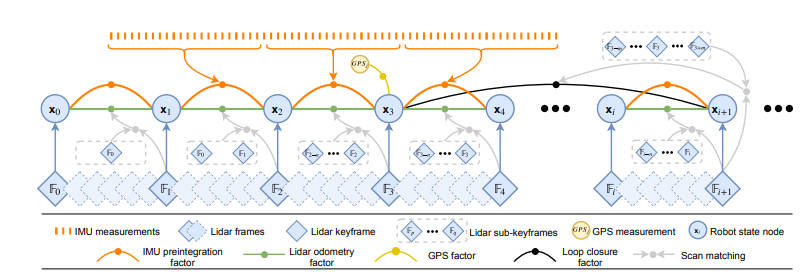
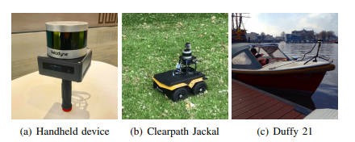
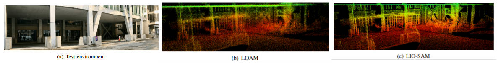
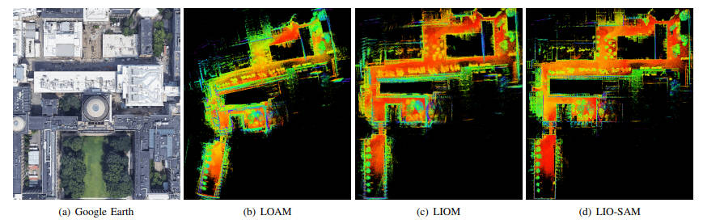
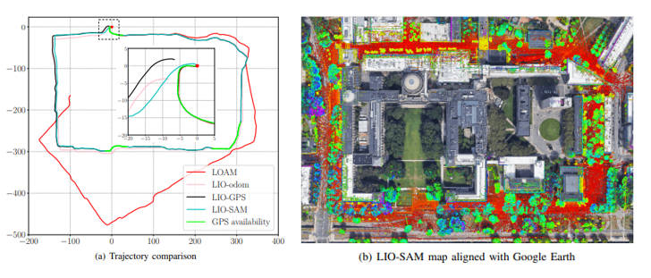
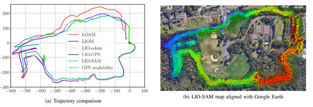
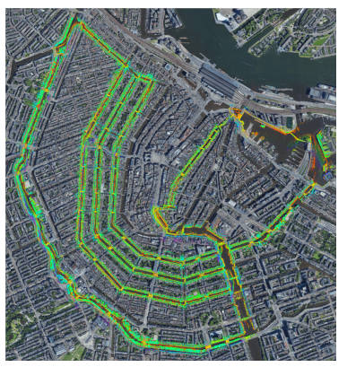

**概要**:

我们提出了一种通过平滑和映射实现激光惯性测距仪紧密耦合的姿态估计框架LIO-SAM,可以实时准确地估计移动机器人的运动轨迹和创建地图。LIO-SAM在因子图的基础上表述了激光惯性测距仪的姿态估计,允许从不同源头将大量的相对测量和绝对测量(包括闭环)作为因子引入系统。从惯性测量单元(IMU)预积分获得的运动估计消除点云的失真,并为激光测距仪姿态优化提供初值。获得的激光测距仪解决方案用于估计IMU的偏差。为确保实时高性能,我们边缘化旧的激光扫描以进行姿态优化,而不是将激光扫描与全局地图匹配。与全局尺度相比,局部尺度的扫描匹配显著提高了系统的实时性能,关键帧的选择性引入和高效的滑动窗口方法(将新关键帧注册到固定大小的“子关键帧”集)也是如此。提出的方法在不同尺度和环境下从三个平台收集的数据集上进行了广泛评估。 

## I. INTRODUCTION

状态估计、定位和映射对移动机器人成功的智能化至关重要,它们是反馈控制、避障和规划等许多能力的基本先决条件。利用视觉感知和激光感知,已经投入了大量精力来实现支持移动机器人6DoF状态估计的高性能实时同步定位和映射(SLAM)。基于视觉的方法通常使用单目相机或立体相机,通过连续图像之间的三角测量来确定相机运动。虽然基于视觉的方法特别适合场景识别,但由于其易受初始化、照明和范围的影响,单独使用时无法可靠地支持自动导航系统。另一方面,基于激光的方法在很大程度上不受照明变化的影响。特别是随着Velodyne VLS-128和Ouster OS1-128等长距离、高分辨率3D激光雷达的出现,激光雷达更适合直接捕捉3D空间环境的细节。因此,本文重点关注基于激光的状态估计和映射方法。

在过去的二十年中,提出了许多基于激光的状态估计和映射方法。其中,在[1]中提出的激光测距仪姿态估计和映射(LOAM)方法用于低漂移和实时状态估计和映射,是最广泛使用的方法之一。LOAM使用激光测距仪和惯性测量单元(IMU),实现最先进的性能,自发布以来一直位列KITTI姿态基准网站[2]上基于激光的最高方法。尽管LOAM获得成功,但它存在一些限制——通过在全局体素地图中保存数据,难以执行闭环检测和纳入其他绝对测量(如GPS)进行姿态校正。在特征丰富的环境中,这种体素地图变得越来越密时,其在线优化过程的效率会降低。LOAM在大规模测试中也会出现漂移,因为在其核心它是一个基于扫描匹配的方法。 

在本文中,我们提出了一种通过平滑和映射实现激光惯性测距仪紧密耦合的姿态估计框架LIO-SAM,以解决上述问题。我们假设点云消失畸变的非线性运动模型,使用原始IMU测量估计激光扫描期间的传感器运动。除了消除点云畸变外,估计的运动还为激光测距仪姿态优化提供初值。然后,获得的激光测距仪解决方案用于在因子图中估计IMU的偏差。

通过引入全局因子图进行机器人运动轨迹估计,我们可以高效地利用激光和IMU测量值进行传感器融合,在机器人姿态之间进行场景识别,并在可用时引入绝对测量值,如GPS定位和罗盘方位。这些来自各种来源的因子用于对图进行联合优化。此外,我们边缘化旧的激光扫描以进行姿态优化,而不是像LOAM那样将扫描与全局地图匹配。与全局尺度相比,局部尺度的扫描匹配显著提高了系统的实时性能,关键帧的选择性引入和高效的滑动窗口方法(将新关键帧注册到固定大小的“子关键帧”集)也是如此。我们工作的主要贡献可以总结如下:

* 建立在因子图之上的紧密耦合的激光惯性测距仪框架,适用于多传感器融合和全局优化。
* 一个高效的、基于局部滑动窗口的扫描匹配方法,通过选择性选择新关键帧并将其注册到固定大小的先验子关键帧集,实现实时性能。
* 该框架在各种尺度、车辆和环境下进行了广泛验证。

## II. RELATED WORK

激光测距仪姿态估计通常通过使用ICP [3]和GICP [4]等扫描匹配方法找到两个连续帧之间的相对变换来完成。由于计算效率高,基于特征的匹配方法已经成为一种流行的替代方法。例如,在[5]中提出了一种基于平面匹配的方法进行实时激光测距仪姿态估计。假设在结构化环境中操作,它从点云中提取平面,并通过求解最小二乘问题匹配这些平面。在[6]中提出了一种基于collar line-based的方法进行姿态估计。在这种方法中,从原始点云中随机生成线段,并用于以后的配准。然而,由于现代3D激光雷达的旋转机构和传感器运动,激光扫描的点云经常会发生畸变。仅使用激光进行姿态估计并不理想,因为使用畸变的点云或特征进行配准最终会导致大的漂移。

因此,激光通常与其他传感器(如IMU和GPS)一起使用进行状态估计和映射。这种利用传感器融合的设计方案通常可以分为两类:松散耦合融合和紧密耦合融合。在LOAM [1]中,IMU用于消除激光扫描的畸变,并为扫描匹配提供运动先验。但是,IMU没有参与算法的优化过程。因此,LOAM可以归类为一种松散耦合方法。在[7]中提出了一种轻量级的用于地面车辆地图任务[8]的地面优化激光测距仪姿态估计和映射(LeGO-LOAM)方法。其IMU测量值的融合与LOAM相同。松散耦合融合的更流行的方法是使用扩展卡尔曼滤波器(EKF)。例如,[9][13]在机器人状态估计的优化阶段使用EKF融合来自激光、惯性和可选GPS的测量值。

紧密耦合的系统通常可以提供更高的精度,目前是正在进行研究的主要焦点[14]。在[15]中,利用预积分的IMU测量消除点云畸变。在[16]中提出了一种机器人中心的激光惯性状态估计器R-LINS。R-LINS使用误差状态Kalman滤波器以紧密耦合的方式递归纠正机器人的状态估计。由于缺乏用于状态估计的其他可用传感器,它在长时间导航中会出现漂移。在[17]中引入了一种紧密耦合的激光惯性测距仪姿态估计和映射框架LIOM。LIOM是LIO映射的缩写,它联合优化来自激光和IMU的测量值,与LOAM相比,其精度类似或更高。由于LIOM旨在处理所有传感器测量值,所以无法实现实时性能——在我们的测试中,其运行速度约为实时的0.6倍。

## III. LIDAR INERTIAL ODOMETRY VIASMOOTHING AND MAPPING

### A. System Overview

我们首先定义整篇论文中使用的坐标系和符号。我们用W表示世界坐标系,B表示机器人体坐标系。为了方便,我们还假设IMU坐标系与机器人体坐标系重合。机器人状态x可以写成:

$$ 
x = [R^T, p^T, v^T, b^T]^T (1)
$$ 

其中R ∈ SO(3)是旋转矩阵,p ∈ $R^3$ 是位置向量,v是速度,b是IMU偏差。从B到W的变换T ∈ SE(3)表示为T = [R | p]。

Fig. 1: The system structure of LIO-SAM. The system receives input from a 3D lidar, an IMU and optionally a GPS. Four types of factorsare introduced to construct the factor graph.: (a) IMU preintegration factor, (b) lidar odometry factor, (c) GPS factor, and (d) loop closurefactor. The generation of these factors is discussed in Section III.

该系统的概述如图1所示。该系统从3D激光雷达、IMU和可选的GPS接收传感器数据。我们的目标是利用这些传感器的观测值估计机器人的状态和其轨迹。这个状态估计问题可以表述为最大后验概率(MAP)问题。我们使用因子图来建模这个问题,因为与贝叶斯网相比,因子图更适合进行推理。假设高斯噪声模型,我们问题的MAP推理等同于求解非线性最小二乘问题[18]。
注意,在不失一般性的前提下,该系统也可以纳入其他传感器的测量,如高度计的高度或罗盘的方位。我们为构建因子图引入四种因子类型和一种变量类型。这个变量代表机器人在特定时间的状态,被分配到图的节点。四种因子类型为:

(a) IMU预积分因子,

(b) 激光测距仪姿态因子

(c) GPS因子

(d) 闭环因子。

当机器人姿态变化超过用户定义的阈值时,向图中添加新的机器人状态节点x。在插入新节点时,使用增量平滑和映射与贝叶斯树(iSAM2)[19]对因子图进行优化。
生成这些因子的过程在以下各节中描述。

### B. IMU预积分因子

IMU的角速度和加速度测量值使用公式2和3定义:

$$
\hat{w}_t = w_t + b^w_t + n^w_t (2) \\
\hat{a}_t = R^{BW}_t(a_t - g) + b^a_t + n^a_t (3) 
$$

其中 $\hat{w}_t$ 和 $\hat{a}_t$ 是时刻t在**B**(Body)坐标系中的原始IMU测量值。$\hat{w}_t$ 和 $\hat{a}_t$ 受缓慢变化的偏差 $b_t$ 和白噪声 $n_t$ 的影响。$R^{BW}_t$ 是从**W**（Wrold）坐标系到**B**（Body）坐标系的旋转矩阵。**g**是**W**（World）坐标系中的恒定重力向量。
我们现在可以使用IMU的测量值推断机器人的运动。机器人在时刻 $t + ∆t$ 的速度、位置和旋转可以计算如下:

$$ v_{t+∆t} = v_t + g∆t + R_t(\hat{a}_t − b^a_t − n^a_t )∆t(4) $$

$$ p_{t+∆t} = p_t + v_t∆t + \frac{1}{2}g∆t^2 + \frac{1}{2}R_t(\hat{a}_t − b^a_t − n^a_t )∆t^2(5) $$

$$ R_{t+∆t} = R_texp((\hat{w}_t - b^w_t - n^w_t )∆t),(6) $$

其中 

$$R_t = R^{WB}_t = R^{BW^T}_t$$ 

这里我们假设B的角速度和加速度在上述积分期间保持不变。
然后,我们应用[20]中提出的IMU预积分方法来获得两时间步之间的相对机体运动。在时刻i和j之间,预积分测量值 $∆v_{ij}$ 、$∆p_{ij}$ 和 $∆R_{ij}$ 可以使用下式计算:

$$∆v_{ij} = R^T_i (v_j − v_i − g∆t_{ij})   (7) $$
$$∆p_{ij} = R^T_i (p_j − p_i − v_i∆t_{ij} − \frac{1}{2}g∆t^2_{ij})(8) $$
$$∆R_{ij} = R^T_i R_j  (9)$$

由于空间限制,我们引用[20]中的描述,详细推导公式7和9。除了效率高外,应用IMU预积分还自然地给我们带来一种约束——IMU预积分因子。IMU偏差与因子图中的激光测距仪因子一起联合优化

### C. 激光测距仪姿态因子 

当接收到新激光扫描时,我们首先执行特征提取。通过评估局部区域内点的粗糙度来提取边缘和平面特征。粗糙度值较大的点被分类为边缘特征。类似地，由较小的粗糙度值被归类为平面特征。我们将在时刻i的激光扫描中提取的边缘和平面特征分别表示为 $F^e_i$ 和 $F^p_i$。

在时刻i提取的所有特征组成激光帧 $F_i$ ，其中 $F_i=\{F^e_i， F^p_i \}$ 。注意，一个激光帧F表示为**B**(Body)坐标系下。特征提取过程的更详细描述可以在[1]或[7]中找到(如果使用距离图像)。

使用每个激光帧计算并添加因子到图中在计算上是不可行的，所以我们采用关键帧选择的概念，这在视觉SLAM领域广泛使用。使用简单但有效的启发法，当与前一状态$x_i$相比，机器人姿态的变化超过用户定义的阈值时，我们选择激光帧$F_{i+1}$作为关键帧。新保存的关键帧$F_{i+1}$与因子图中的新机器人状态节点$x_{i+1}$相关联。两个关键帧之间的激光帧被丢弃。这样添加关键帧不仅在地图密度和内存消耗之间达到平衡，而且有助于维持一个相对稀疏的因子图，这适合实时非线性优化。 
在我们的工作中，添加新关键帧的位置和旋转变化阈值分别选择为1米和10°。 

假设我们想要向因子图添加一个新状态节点$x_{i+1}$。与此状态相关联的激光关键帧是$F_{i+1}$。生成激光测距仪因子的步骤如下: 

1). 用于体素地图的子关键帧:我们实现滑动窗口方法来创建包含固定数量最近激光扫描的点云地图。不是优化两个连续激光扫描之间的变换，我们提取n个最近的关键帧，我们称之为子关键帧，用于估计。子关键帧集合 $\{F_{i−n}， ...， F_i\}$ 然后使用与之关联的变换 $\{T_{i−n}， ...， T_i\}$ 转换到W框架。转换后的子关键帧合并到体素地图$M_i$中。由于我们在前面的特征提取步骤中提取两种类型的特征，$M_i$由两个子体素地图组成，表示为${M^e_i}$，边缘特征体素地图，和${M^p_i}$，平面特征体素地图。激光帧和体素地图之间的关系如下:
$${M}_{i}={M_{i}^{e}， {M}_{i}^{p}} $$
其中  
$$
{M}_{i}^{e}='F_{i}^{e} \cup'{F}_{i-1}^{e} \cup \ldots \cup '{F}_{i-n}^{e} 
$$
$$
{M}_{i}^{p} = '{F}_{i}^{p} \cup '{F}_{i-1}^{p} \cup \ldots \cup '{F}_{i-n}^{p} 
$$ 

$‘F^e_i$ 和 $‘F^p_i$ 是W中的转换后的边缘和平面特征。${M}_{i}^{e}$ 和 ${M}_{i}^{p}$ 然后下采样以消除落在同一个体素单元中的重复特征。在本文中，n被选择为25。 ${M}_{i}^{e}$ 和 ${M}_{i}^{p}$ 的下采样分辨率分别为0.2米和0.4米。 

2). 扫描匹配:我们通过扫描匹配将新获得的激光帧$F_{i+1}$，也是$\{F^e_{i+1}， F^p_{i+1}\}$，与$M_i$匹配。可以利用各种扫描匹配方法，如[3]和[4]来完成此目的。这里我们选择[1]中的方法，因为其计算效率高和在各种困难环境下的鲁棒性。 
我们首先将$\{F^e_{i+1}， F^p_{i+1}\}$从B转换到W，得到$\{‘F^e_{i+1}， ‘F^p_{i+1}\}$。这个初始变换是使用来自IMU的预测机器人运动$\widetilde{T}_{i+1}$得到的。对于$‘F^e_{i+1}$或$‘F^p_{i+1}$中的每个特征，我们然后在${M}_{i}^{e}$或${M}_{i}^{p}$中找到其边缘或平面对应项。为了简洁起见，这里省略了找到这些对应项的详细步骤，但在[1]中有详细描述。

3)相对变换:特征与其边缘或平面补丁对应物之间的距离可以使用以下公式计算: 

$$
d_{e_k} = \frac
{| (p^e_{i+1,k} - p^e_{i,u}) \times (p^e_{i+1,k} - p^e_{i,v}) |}
{|  p^e_{i,u} -  p^e_{i,v} |} (10)\\

d_{p_k} = \frac
{|  (p^e_{i+1,k} - p^e_{i,u}) (p^e_{i,u} -  p^e_{i,v}) \times (p^e_{i,u} -  p^e_{i,w}) |}
{| (p^e_{i,u} -  p^e_{i,v}) \times (p^e_{i,u} -  p^e_{i,w}) |}
(11)
$$

where k， u， v， and w are the feature indices in the ircorresponding sets. For an edge feature $p^e_{i+1，k}$ in $′F^e_{i+1}$， $p^e_{i，u}$ and $p^e_{i，v}$ are the points that form the corresponding edge line in $M^e_i$. For a planar feature $p^p_{i+1，k}$ in $′F^p_{i+1}， p^p_{i，u}， p^p_{i，v}，and p^p_{i，w}$ form the corresponding planar patch in $M^p_i$ . The GaussNewton method is then used to solve for the optimal transformation by minimizing:

$$
\min_{T_{i+1}} 
\left \{ 
    \sum_{ {p^e_{i+1，k}} \in {′F^e_{i+1}}} {d_{e_k}} + \sum_{ p^p_{i+1，k} \in ′F^p_{i+1}}{d_{p_k}} 
\right \} 
$$

At last， we can obtain the relative transformation ∆Ti，i+1between xi and xi+1， which is the lidar odometry factorlinking these two poses:
$$
∆T_{i，i+1} = T^T_i T_{i+1}(12)
$$

We note that an alternative approach to obtain $∆T_{i，i+1}$ is to transform sub-keyframes into the frame of $x_i$. In otherwords， we match $F_{i+1}$ to the voxel map that is represented inthe frame of $x_i$. In this way， the real relative transformation $∆T_{i，i+1}$ can be directly obtained. Because the transformedfeatures $′F^e_i$ and $′F^p_i$ can be reused multiple times， we insteadopt to use the approach described in Sec. III-C.1 for its computational efficiency.

### D. GPS Factor

Though we can obtain reliable state estimation and mapping by utilizing only IMU preintegration and lidar odometryfactors， the system still suffers from drift during longduration navigation tasks. To solve this problem， we canintroduce sensors that offer absolute measurements for eliminating drift. Such sensors include an altimeter， compass， andGPS. For the purposes of illustration here， we discuss GPS，as it is widely used in real-world navigation systems.
When we receive GPS measurements， we first transformthem to the local Cartesian coordinate frame using themethod proposed in [21]. Upon the addition of a new node tothe factor graph， we then associate a new GPS factor with thisnode. If the GPS signal is not hardware-synchronized withthe lidar frame， we interpolate among GPS measurementslinearly based on the timestamp of the lidar frame.

Fig. 2: Datasets are collected on 3 platforms: (a) a custom-builthandheld device， (b) an unmanned ground vehicle - ClearpathJackal， (c) an electric boat - Duffy 21.

We note that adding GPS factors constantly when GPSreception is available is not necessary because the drift of lidar inertial odometry grows very slowly. In practice， we onlyadd a GPS factor when the estimated position covariance islarger than the received GPS position covariance.

E. Loop Closure Factor

Thanks to the utilization of a factor graph， loop closurescan also be seamlessly incorporated into the proposed system， as opposed to LOAM and LIOM. For the purposes ofillustration， we describe and implement a naive but effectiveEuclidean distance-based loop closure detection approach.
We also note that our proposed framework is compatiblewith other methods for loop closure detection， for example，[22] and [23]， which generate a point cloud descriptor anduse it for place recognition.

When a new state xi+1 is added to the factor graph， wefirst search the graph and find the prior states that are close toxi+1 in Euclidean space. As is shown in Fig. 1， for example，x3 is one of the returned candidates. We then try to matchFi+1 to the sub-keyframes {F3−m， ...， F3， ...， F3+m} usingscan-matching. Note that Fi+1 and the past sub-keyframesare first transformed into W before scan-matching. Weobtain the relative transformation ∆T3，i+1 and add it as aloop closure factor to the graph. Throughout this paper， wechoose the index m to be 12， and the search distance forloop closures is set to be 15m from a new state xi+1.
In practice， we find adding loop closure factors is especially useful for correcting the drift in a robot’s altitude， whenGPS is the only absolute sensor available. This is because theelevation measurement from GPS is very inaccurate - givingrise to altitude errors approaching 100m in our tests， in theabsence of loop closures.

IV. EXPERIMENTS

We now describe a series of experiments to qualitativelyand quantitatively analyze our proposed framework. Thesensor suite used in this paper includes a Velodyne VLP16 lidar， a MicroStrain 3DM-GX5-25 IMU， and a Reach MGPS. For validation， we collected 5 different datasets acrossvarious scales， platforms and environments. These datasetsare referred to as Rotation， Walking， Campus， Park andAmsterdam， respectively. The sensor mounting platforms areshown in Fig. 2. The first three datasets were collected using a custom-built handheld device on the MIT campus. The Park

dataset was collected in a park covered by vegetation, usingan unmanned ground vehicle (UGV) - the Clearpath Jackal.
The last dataset, Amsterdam, was collected by mounting thesensors on a boat and cruising in the canals of Amsterdam.
The details of these datasets are shown in Table I.

TABLE I: Dataset details

DatasetScansElevationchange (m)Trajectorylength (m)Max rotationspeed (◦/s)

Rotation58200213.9Walking65020.3801133.7Campus98651.01437124.8Park2469119.02898217.4Amsterdam10765601906517.2

We compare the proposed LIO-SAM framework withLOAM and LIOM. In all the experiments, LOAM and LIOSAM are forced to run in real-time. LIOM, on the other hand,is given infinite time to process every sensor measurement.
All the methods are implemented in C++ and executed ona laptop equipped with an Intel i7-10710U CPU using therobot operating system (ROS) [24] in Ubuntu Linux. We notethat only the CPU is used for computation, without parallelcomputing enabled. Our implementation of LIO-SAM isfreely available on [Github](https://github.com/TixiaoShan/LIO-SAM). Supplementary details of theexperiments performed, including complete visualizations ofall tests, can be found at the [link](https://youtu.be/A0H8CoORZJU
).

Fig. 3: Mapping results of LOAM and LIO-SAM in the Rotationtest. LIOM fails to produce meaningful results.

A. Rotation DatasetIn this test, we focus on evaluating the robustness of ourframework when only IMU preintegration and lidar odometry factors are added to the factor graph. The Rotation dataset iscollected by a user holding the sensor suite and performinga series of aggressive rotational maneuvers while standingstill. The maximum rotational speed encountered in this testis 133.7°/s. The test environment, which is populated withstructures, is shown in Fig. 3(a). The maps obtained fromLOAM and LIO-SAM are shown in Figs. 3(b) and (c) respectively. Because LIOM uses the same initialization pipelinefrom [25], it inherits the same initialization sensitivity ofvisual-inertial SLAM and is not able to initialize properlyusing this dataset. Due to its failure to produce meaningfulresults, the map of LIOM is not shown. As is shown, themap of LIO-SAM preserves more fine structural details ofthe environment compared with the map of LOAM. Thisis because LIO-SAM is able to register each lidar frameprecisely in SO(3), even when the robot undergoes rapidrotation.

B. Walking Dataset

Fig. 4: Mapping results of LOAM, LIOM, and LIO-SAM using the Walking dataset. The map of LOAM in (b) diverges multiple timeswhen aggressive rotation is encountered. LIOM outperforms LOAM. However, its map shows numerous blurry structures due to inaccuratepoint cloud registration. LIO-SAM produces a map that is consistent with the Google Earth imagery, without using GPS.

This test is designed to evaluate the performance of ourmethod when the system undergoes aggressive translationsand rotations in SE(3). The maximum translational androtational speed encountered is this dataset is 1.8 m/s and213.9°/s respectively. During the data gathering, the userholds the sensor suite shown in Fig. 2(a) and walks quicklyacross the MIT campus (Fig. 4(a)). In this test, the map ofLOAM, shown in Fig. 4(b), diverges at multiple locationswhen aggressive rotation is encountered. LIOM outperformsLOAM in this test. However, its map, shown in Fig. 4(c),still diverges slightly in various locations and consists ofnumerous blurry structures. Because LIOM is designed toprocess all sensor measurements, it only runs at 0.56× realtime while other methods are running in real-time. Finally,LIO-SAM outperforms both methods and produces a mapthat is consistent with the available Google Earth imagery.

C. Campus Dataset

TABLE II: End-to-end translation error (meters)

DatasetLOAMLIOMLIO-odomLIO-GPSLIO-SAM

Campus192.43Fail9.446.870.12Park121.7434.6036.362.930.04AmsterdamFailFailFail1.210.17

This test is designed to show the benefits of introducingGPS and loop closure factors. In order to do this, wepurposely disable the insertion of GPS and loop closurefactors into the graph. When both GPS and loop closurefactors are disabled, our method is referred to as LIO-odom,which only utilizes IMU preintegration and lidar odometryfactors. When GPS factors are used, our method is referred toas LIO-GPS, which uses IMU preintegration, lidar odometry,and GPS factors for graph construction. LIO-SAM uses allfactors when they are available.

Fig. 5: Results of various methods using the Campus dataset thatis gathered on the MIT campus. The red dot indicates the start andend location. The trajectory direction is clock-wise. LIOM is notshown because it fails to produce meaningful results.

To gather this dataset, the user walks around the MITcampus using the handheld device and returns to the sameposition. Because of the numerous buildings and trees in the mapping area, GPS reception is rarely available and inaccurate most of the time. After filtering out the inconsistent GPSmeasurements, the regions where GPS is available are shownin Fig. 5(a) as green segments. These regions correspond tothe few areas that are not surrounded by buildings or trees.
The estimated trajectories of LOAM, LIO-odom, LIOGPS, and LIO-SAM are shown in Fig. 5(a). The results ofLIOM are not shown due to its failure to initialize properlyand produce meaningful results. As is shown, the trajectoryof LOAM drifts significantly when compared with all othermethods. Without the correction of GPS data, the trajectoryof LIO-odom begins to visibly drift at the lower right cornerof the map. With the help of GPS data, LIO-GPS can correctthe drift when it is available. However, GPS data is notavailable in the later part of the dataset. As a result, LIOGPS is unable to close the loop when the robot returnsto the start position due to drift. On the other hand, LIOSAM can eliminate the drift by adding loop closure factorsto the graph. The map of LIO-SAM is well-aligned withGoogle Earth imagery and shown in Fig. 5(b). The relativetranslational error of all methods when the robot returns tothe start is shown in Table II.

D. Park Dataset

In this test, we mount the sensors on a UGV and drivethe vehicle along a forested hiking trail. The robot returnsto its initial position after 40 minutes of driving. The UGVis driven on three road surfaces: asphalt, ground covered bygrass, and dirt-covered trails. Due to its lack of suspension,the robot undergoes low amplitude but high frequency vibrations when driven on non-asphalt roads.
To mimic a challenging mapping scenario, we only useGPS measurements when the robot is in widely open areas,which is indicated by the green segments in Fig. 6(a). Such amapping scenario is representative of a task in which a robotmust map multiple GPS-denied regions and periodicallyreturns to regions with GPS availability to correct the drift.
Similar to the results in the previous tests, LOAM, LIOM,and LIO-odom suffer from significant drift, since no absolutecorrection data is available. Additionally, LIOM only runs at 0.67× real-time, while the other methods run in real-time.
Though the trajectories of LIO-GPS and LIO-SAM coincidein the horizontal plane, their relative translational errors aredifferent (Table II). Because no reliable absolute elevationmeasurements are available, LIO-GPS suffers from drift inaltitude and is unable to close the loop when returning tothe robot’s initial position. LIO-SAM has no such problem,as it utilizes loop closure factors to eliminate the drift.

E. Amsterdam Dataset

Finally, we mounted the sensor suite on a boat and cruisedalong the canals of Amsterdam for 3 hours. Although themovement of the sensors is relatively smooth in this test,mapping the canals is still challenging for several reasons.
Many bridges over the canals pose degenerate scenarios, asthere are few useful features when the boat is under them,similar to moving through a long, featureless corridor. Thenumber of planar features is also significantly less, as theground is not present. We observe many false detections fromthe lidar when direct sunlight is in the sensor field-of-view,which occurs about 20% of the time during data gathering.
We also only obtain intermittent GPS reception due to thepresence of bridges and city buildings overhead.
Due to these challenges, LOAM, LIOM, and LIO-odomall fail to produce meaningful results in this test. Similarto the problems encountered in the Park dataset, LIO-GPSis unable to close the loop when returning to the robot’sinitial position because of the drift in altitude, which furthermotivates our usage of loop closure factors in LIO-SAM.

F. Benchmarking Results

TABLE III: RMSE translation error w.r.t GPS

DatasetLOAMLIOMLIO-odomLIO-GPSLIO-SAM

Park47.3128.9623.961.090.96

Since full GPS coverage is only available in the Parkdataset, we show the root mean square error (RMSE) resultsw.r.t to the GPS measurement history, which is treated as ground truth. This RMSE error does not take the error alongthe z axis into account. As is shown in Table III, LIO-GPSand LIO-SAM achieve similar RMSE error with respect tothe GPS ground truth. Note that we could further reduce theerror of these two methods by at least an order of magnitude by giving them full access to all GPS measurements.
However, full GPS access is not always available in manymapping settings. Our intention is to design a robust systemthat can operate in a variety of challenging environments.
The average runtime for the three competing methods toregister one lidar frame across all five datasets is shownin Table IV. Throughout all tests, LOAM and LIO-SAMare forced to run in real-time. In other words, some lidarframes are dropped if the runtime takes more than 100mswhen the lidar rotation rate is 10Hz. LIOM is given infinitetime to process every lidar frame. As is shown, LIO-SAMuses significantly less runtime than the other two methods,which makes it more suitable to be deployed on low-power embedded systems.

Fig. 6: Results of various methods using the Park dataset that isgathered in Pleasant Valley Park, New Jersey. The red dot indicatesthe start and end location. The trajectory direction is clock-wise.

TABLE IV: Runtime of mapping for processing one scan (ms)

DatasetLOAMLIOMLIO-SAMStress test

Rotation83.6Fail41.913×Walking253.6339.858.413×Campus244.9Fail97.810×Park266.4245.2100.59×AmsterdamFailFail79.311×

We also perform stress tests on LIO-SAM by feeding itthe data faster than real-time. The maximum data playbackspeed is recorded and shown in the last column of TableIV when LIO-SAM achieves similar performance withoutfailure compared with the results when the data playbackspeed is 1× real-time. As is shown, LIO-SAM is able toprocess data faster than real-time up to 13×.
We note that the runtime of LIO-SAM is more significantly influenced by the density of the feature map, andless affected by the number of nodes and factors in thefactor graph. For instance, the Park dataset is collected ina feature-rich environment where the vegetation results in alarge quantity of features, whereas the Amsterdam datasetyields a sparser feature map. While the factor graph of thePark test consists of 4,573 nodes and 9,365 factors, the graphin the Amsterdam test has 23,304 nodes and 49,617 factors.
Despite this, LIO-SAM uses less time in the Amsterdam test
as opposed to the runtime in the Park test.

Fig. 7: Map of LIO-SAM aligned with Google Earth.

## V. CONCLUSIONS AND DISCUSSION

We have proposed LIO-SAM, a framework for tightlycoupled lidar inertial odometry via smoothing and mapping,for performing real-time state estimation and mapping incomplex environments. By formulating lidar-inertial odometry atop a factor graph, LIO-SAM is especially suitablefor multi-sensor fusion. Additional sensor measurements caneasily be incorporated into the framework as new factors.
Sensors that provide absolute measurements, such as a GPS,compass, or altimeter, can be used to eliminate the drift oflidar inertial odometry that accumulates over long durations,or in feature-poor environments. Place recognition can alsobe easily incorporated into the system. To improve thereal-time performance of the system, we propose a slidingwindow approach that marginalizes old lidar frames for scanmatching. Keyframes are selectively added to the factorgraph, and new keyframes are registered only to a fixedsize set of sub-keyframes when both lidar odometry andloop closure factors are generated. This scan-matching ata local scale rather than a global scale facilitates the realtime performance of the LIO-SAM framework. The proposedmethod is thoroughly evaluated on datasets gathered on threeplatforms across a variety of environments. The results showthat LIO-SAM can achieve similar or better accuracy whencompared with LOAM and LIOM. Future work involvestesting the proposed system on unmanned aerial vehicles.

## REFERENCES

[1] J. Zhang and S. Singh, “Low-drift and Real-time Lidar Odometry andMapping,” Autonomous Robots, vol. 41(2): 401-416, 2017.

[2] A. Geiger, P. Lenz, and R. Urtasun, “Are We Ready for AutonomousDriving? The KITTI Vision Benchmark Suite”, IEEE InternationalConference on Computer Vision and Pattern Recognition, pp. 33543361, 2012.

[3] P.J. Besl and N.D. McKay, “A Method for Registration of 3D Shapes,”IEEE Transactions on Pattern Analysis and Machine Intelligence, vol.
14(2): 239-256, 1992.

[4] A. Segal, D. Haehnel, and S. Thrun, “Generalized-ICP,” Proceedingsof Robotics: Science and Systems, 2009.

[5] W.S. Grant, R.C. Voorhies, and L. Itti, “Finding Planes in LiDARPoint Clouds for Real-time Registration,” IEEE/RSJ InternationalConference on Intelligent Robots and Systems, pp. 4347-4354, 2013.

[6] M. Velas, M. Spanel, and A. Herout, “Collar Line Segments for FastOdometry Estimation from Velodyne Point Clouds,” IEEE International Conference on Robotics and Automation, pp. 4486-4495, 2016.

[7] T. Shan and B. Englot, “LeGO-LOAM: Lightweight and Groundoptimized Lidar Odometry and Mapping on Variable Terrain,”IEEE/RSJ International Conference on Intelligent Robots and Systems,pp. 4758-4765, 2018.

[8] T. Shan, J. Wang, K. Doherty, and B. Englot, “Bayesian GeneralizedKernel Inference for Terrain Traversability Mapping,” In Conferenceon Robot Learning, pp. 829-838, 2018.

[9] S. Lynen, M.W. Achtelik, S. Weiss, M. Chli, and R. Siegwart, “ARobust and Modular Multi-sensor Fusion Approach Applied to MAVNavigation,” IEEE/RSJ International Conference on Intelligent Robotsand Systems, pp. 3923-3929, 2013.

[10] S. Yang, X. Zhu, X. Nian, L. Feng, X. Qu, and T. Mal, “A RobustPose Graph Approach for City Scale LiDAR Mapping,” IEEE/RSJInternational Conference on Intelligent Robots and Systems, pp. 11751182, 2018.

[11] M. Demir and K. Fujimura, “Robust Localization with Low-MountedMultiple LiDARs in Urban Environments,” IEEE Intelligent Transportation Systems Conference, pp. 3288-3293, 2019.

[12] Y. Gao, S. Liu, M. Atia, and A. Noureldin, “INS/GPS/LiDAR Integrated Navigation System for Urban and Indoor Environments usingHybrid Scan Matching Algorithm,” Sensors, vol. 15(9): 23286-23302,2015.

[13] S. Hening, C.A. Ippolito, K.S. Krishnakumar, V. Stepanyan, and M.
Teodorescu, “3D LiDAR SLAM integration with GPS/INS for UAVsin urban GPS-degraded environments,” AIAA Infotech@AerospaceConference, pp. 448-457, 2017.

[14] C. Chen, H. Zhu, M. Li, and S. You, “A Review of Visual-InertialSimultaneous Localization and Mapping from Filtering-Based andOptimization-Based Perspectives,” Robotics, vol. 7(3):45, 2018.

[15] C. Le Gentil,, T. Vidal-Calleja, and S. Huang, “IN2LAMA: InertialLidar Localisation and Mapping,” IEEE International Conference onRobotics and Automation, pp. 6388-6394, 2019.

[16] C. Qin, H. Ye, C.E. Pranata, J. Han, S. Zhang, and Ming Liu, “RLINS: A Robocentric Lidar-Inertial State Estimator for Robust andEfficient Navigation,” arXiv:1907.02233, 2019.

[17] H. Ye, Y. Chen, and M. Liu, “Tightly Coupled 3D Lidar InertialOdometry and Mapping,” IEEE International Conference on Roboticsand Automation, pp. 3144-3150, 2019.

[18] F. Dellaert and M. Kaess, “Factor Graphs for Robot Perception,”Foundations and Trends in Robotics, vol. 6(1-2): 1-139, 2017.

[19] M. Kaess, H. Johannsson, R. Roberts, V. Ila, J.J. Leonard, and F.
Dellaert, “iSAM2: Incremental Smoothing and Mapping Using theBayes Tree,” The International Journal of Robotics Research, vol.
31(2): 216-235, 2012.

[20] C. Forster, L. Carlone, F. Dellaert, and D. Scaramuzza, “On-ManifoldPreintegration for Real-Time Visual-Inertial Odometry,” IEEE Transactions on Robotics, vol. 33(1): 1-21, 2016.

[21] T. Moore and D. Stouch, “A Generalized Extended Kalman FilterImplementation for The Robot Operating System,” Intelligent Autonomous Systems, vol. 13: 335-348, 2016.

[22] G. Kim and A. Kim, “Scan Context: Egocentric Spatial Descriptor forPlace Recognition within 3D Point Cloud Map,” IEEE/RSJ International Conference on Intelligent Robots and Systems, pp. 4802-4809,2018.

[23] J. Guo, P. VK Borges, C. Park, and A. Gawel, “Local Descriptor forRobust Place Recognition using Lidar Intensity,” IEEE Robotics andAutomation Letters, vol. 4(2): 1470-1477, 2019.

[24] M. Quigley, K. Conley, B. Gerkey, J. Faust, T. Foote, J. Leibs,R. Wheeler, and A.Y. Ng, “ROS: An Open-source Robot OperatingSystem,” IEEE ICRA Workshop on Open Source Software, 2009.

[25] T. Qin, P. Li, and S. Shen, “Vins-mono: A Robust and VersatileMonocular Visual-Inertial State Estimator,” IEEE Transactions onRobotics, vol. 34(4): 1004-1020, 2018.

